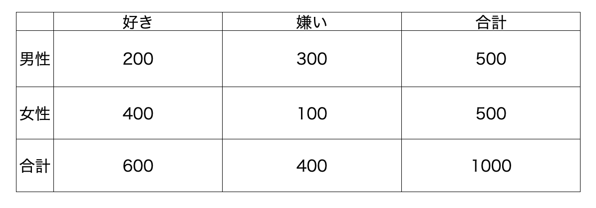
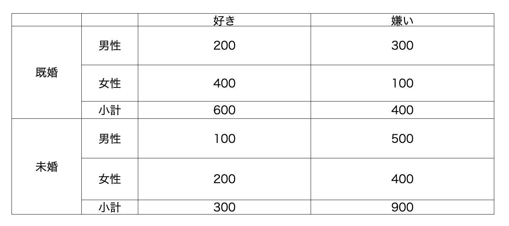
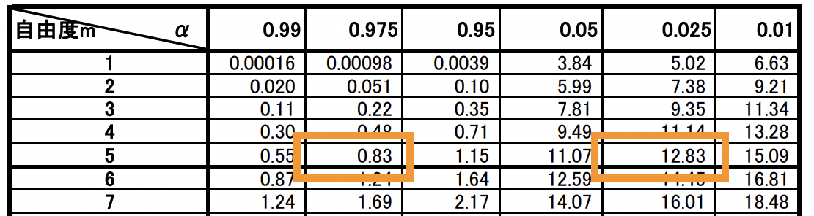
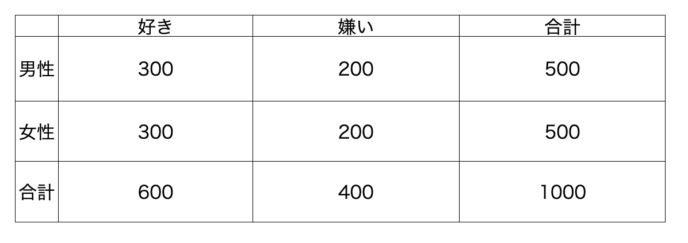
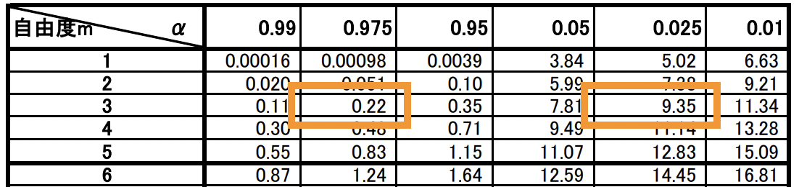
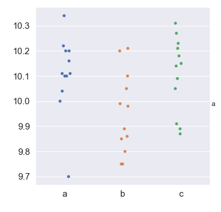
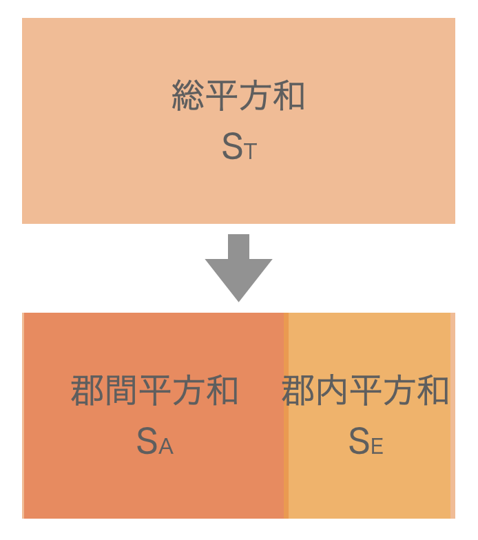
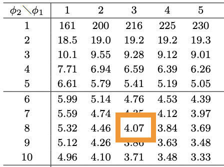

# 第10回　検定③、分散分析

#### ■ 問1　適合度検定
<b>度数表（度数分布表）</b>
各カテゴリに属する個数のことを度数といい、下のように度数を集計した表を度数表（度数分布表）という。
質的変数だけではなく、量的変数も区間を設定することで度数表を作成することができる。

| 点数 | 人数 |
| :-: | :-: |
| 0~20 | 5 | 
| 21~40 | 10 |
| 41~60 | 15 |
| 61~80 | 15 |
| 81~100 | 10 |
| 計 | 55 |

<b>クロス集計表</b>
「男性・女性」「はい・いいえ」「好き・嫌い」「A・B・C」などのカテゴリデータを2種類組み合わせて同時に集計することをクロス集計といい、下のように各度数を集計した表を（2元）クロス集計表という。

カテゴリデータを3種類以上組み合わせて同時に集計した表を（多元）クロス集計表という。

<b>適合度検定</b>
観測したカテゴリデータの観測度数（実測値）と期待度数（理論値）をクロス集計表にまとめ、観測度数と期待度数にどれだけのズレがあるかどうかを確認する検定。
カテゴリデータのそれぞれの観測度数と期待度数のズレを二乗したものを期待度数で割った値を全て足した値は自由度$n-1$の$\chi^{2}$分布に従う。

計算の例：
大吉、中吉、吉、凶がそれぞれ同じ数だけ入っているおみくじから、引いたおみくじを元に戻して200回引く。
それぞれ同じ数入っているので、期待度数はそれぞれ50になる。
観測度数は実際に200回引いて、出た結果を集計したもの。

| おみくじ | 大吉 | 中吉 | 吉 | 凶 | 計 |
|:-:| :-: | :-: | :-: | :-: | :-: |
| 観測度数 | 55 | 40 | 45 | 60 | 200 |
| 期待度数| 50 | 50 | 50 | 50 | 200 |

観測度数と期待度数のズレを$\chi^{2}$で表すと、以下のように算出される。
$$
\chi^{2} = \frac{(55-50)^{2}}{50} + \frac{(40-50)^{2}}{50} + \frac{(45-50)^{2}}{50} + \frac{(60-50)^{2}}{50} = 5
$$

この値と$\chi^{2}$分布から求められる値を比較する。

\
適合度検定の手順
①帰無仮説$H_{0}$：観測度数と期待度数にズレはない、対立仮説$H_{1}$：観測度数と期待度数にズレがある、を設定する。
②有意水準$\alpha$を設定する。
③自由度と有意水準から、棄却域を確認する。
④統計検定量$\chi^{2}_{0}$の値を計算する。
⑤統計検定量$\chi^{2}_{0}$が棄却域に入っていれば「有意である」と判定し、帰無仮説$H_{0}$を棄却する。

■ 解答
1.
クロス集計表は以下の通り。
| | 1 | 2 | 3 | 4 | 5 | 6 | 計 |
|:-:| ---- | ---- | ---- | ---- | ---- | ---- | ---- |
| 観測度数 | 44 | 32 | 68 | 54 | 46 | 56 | 300 | 
| 期待度数 | 50 | 50 | 50 | 50 | 50 | 50 | 300 |

2.　
それぞれのサイコロの目の観測度数と期待度数の差の二乗値をクロス集計表にまとめると以下のようになる。
| | 1 | 2 | 3 | 4 | 5 | 6 | 計 |
|:-:| ---- | ---- | ---- | ---- | ---- | ---- | ---- |
| 観測度数 | 44 | 32 | 68 | 54 | 46 | 56 | 300 | 
| 期待度数 | 50 | 50 | 50 | 50 | 50 | 50 | 300 |
| 差の二乗 | (44-50)2 =36 | (32-50)2 =324 | (68-50)2 =324 | (54-50)2 =16 | (46-50)2 =16 | (56-50)2 =36 | |

3.　
それぞれのサイコロの目の観測度数と期待度数の差の二乗値を期待度数で割った値をクロス集計表にまとめると以下のようになる。
| | 1 | 2 | 3 | 4 | 5 | 6 | 計 |
|:-:| ---- | ---- | ---- | ---- | ---- | ---- | ---- |
| 観測度数 | 44 | 32 | 68 | 54 | 46 | 56 | 300 | 
| 期待度数 | 50 | 50 | 50 | 50 | 50 | 50 | 300 |
| 差の二乗 | 36 | 324 | 324 | 16 | 16 | 36 | |
| 差の二乗/期待度数 | 36/50 =0.72 | 324/50 =6.48 | 324/50 =6.48 | 16/50 =0.32 | 16/50 =0.32 | 36/50 =0.72 | |

4.　
3.のクロス集計表から$\chi_{0}^{2}$値を計算すると、以下の通りとなる。
$$
\begin{align}
\chi_{0}^{2} &= 0.72 + 6.48 + 6.48 + 0.32 + 0.32 + 0.72\\
&= 15.04
\end{align}
$$

5.　
この問題では、帰無仮説$H_{0}$：観測度数と期待度数にズレはない、対立仮説$H_{1}$：観測度数と期待度数にズレがある、である。
自由度$6-1= 5$より、$\chi^{2}$分布表から棄却域は$\chi^{2}_{0} \leq 0.83$または$\chi^{2}_{0} \geq 12.83$

\
4.で求めたとおり、$\chi^{2}_{0}=15.04 \geq 12.83$となるので有意である。
よって、帰無仮説$H_{0}$は棄却される。
すなわち、観測度数と期待度数にはズレがあると言える。

#### ■ 問2　Pythonを使って適合度検定

notebook参照

#### ■ 問3　独立性の検定
<b>独立性の検定</b>
2種類以上の観測したカテゴリデータに関連（独立性）があるかどうかを確認する検定。
観測したそれぞれのカテゴリデータから期待度数を算出し、観測度数とどれだけのズレがあるかどうかを確認する。
観測度数と期待度数のズレが大きければ、カテゴリデータに関連がある（独立性がない）とする。
適合度検定と同様に、カテゴリデータのそれぞれの観測度数と期待度数のズレを二乗したものを期待度数で割った値を全て足した値は自由度$(n-1)\times(m-1)$の$\chi^{2}$分布に従う。

計算の例:
男性500人、女性500人に料理が好きか嫌いかのアンケート結果を集計したところ、結果は以下のようになった。

観測度数

結果から、料理が好きな人が600人、料理が嫌いな人が400人だとわかる。
性別と料理の好き嫌いに関連がない（独立である）場合、

料理が好きな男性の期待度数は
$$
600(料理が好きな人) \times \frac{500(男性の数)}{500(男性の数)+500(女性の数)} = 300
$$
料理が嫌いな男性の期待度数は
$$
400(料理が嫌いな人) \times \frac{500(男性の数)}{500(男性の数)+500(女性の数)} = 200
$$
女性の方も同様に計算して、期待度数をまとめると以下のようになる。

期待度数

観測度数と期待度数のズレを$\chi^{2}$で表すと、以下のように算出される。
$$
\chi^{2} = \frac{(200-300)^{2}}{300} + \frac{(300-200)^{2}}{200} + \frac{(400-300)^{2}}{300} + \frac{(100-200)^{2}}{200} = 166
$$

この値と$\chi^{2}$分布から求められる値を比較する。

\
独立性の検定の手順
①帰無仮説$H_{0}$：カテゴリデータは独立である、対立仮説$H_{1}$：カテゴリデータは独立でない、を設定する。
②有意水準$\alpha$を設定する。
③自由度と有意水準から、棄却域を確認する。
④統計検定量$\chi^{2}_{0}$の値を計算する。
⑤統計検定量$\chi^{2}_{0}$が棄却域に入っていれば「有意である」と判定し、帰無仮説$H_{0}$を棄却する。

■ 解答
1.　
各装置から製造された鉛筆の小計を追加したクロス集計表は以下のとおり。
| | 良品 | 不良品 | 計 |
|:-:| :-: | :-: | :-: |
| HB | 120 | 24 | 144 | 
| B | 240 | 32 | 272 |
| 2B | 150 | 10 | 160 |
| 3B | 190 | 34 | 224 |

2.　
良品、不良品の小計を追加したクロス集計表は以下のとおり。
| | 良品 | 不良品 | 計 |
|:-:| :-: | :-: | :-: |
| HB | 120 | 24 | 144 | 
| B | 240 | 32 | 272 |
| 2B | 150 | 10 | 160 |
| 3B | 190 | 34 | 224 |
| 計 | 700 | 100 | |

3.　
全ての合計値を追加したクロス集計表は以下のとおり。
| | 良品 | 不良品 | 計 |
|:-:| :-: | :-: | :-: |
| HB | 120 | 24 | 144 | 
| B | 240 | 32 | 272 |
| 2B | 150 | 10 | 160 |
| 3B | 190 | 34 | 224 |
| 計 | 700 | 100 | 800 |

4.　
全ての濃さの鉛筆で良品、不良品のできる確率が等しいとすると、
例えばHBの良品の期待度数は以下の式で計算できる。
$$
鉛筆の合計 \times \frac{良品の数}{鉛筆の合計} \times \frac{HBの鉛筆の数}{鉛筆の合計} = \frac{良品の数 \times HBの鉛筆の数}{鉛筆の合計}
$$
数値を代入して計算すると、
$$
\frac{700 \times 144}{800} = 126
$$
同様に他の値も計算すると、期待度数のクロス集計表は以下の通りとなる。

| | 良品 | 不良品 | 計 |
|:-:| :-: | :-: | :-: |
| HB | 126 | 18 | 144 | 
| B | 238 | 34 | 272 |
| 2B | 140 | 20 | 160 |
| 3B | 196 | 28 | 224 |
| 計 | 700 | 100 | 800 |

5.　
3.と4.の観測度数と期待度数のクロス集計表から$\chi_{0}^{2}$値を計算すると、以下の通りとなる。

| | 良品 | 不良品 |
|:-:| :-: | :-: |
| HB | (120-126)2/126 =0.286 | (24-18)2/18 =2 | 
| B | (240-238)2/238 =0.0168 | (32-34)2/34 =0.118 |
| 2B | (150-140)2/140 =0.714 | (10-20)2/20 =5 |
| 3B | (190-196)2/196 =0.184 | (34-28)2/28 =1.286 |

$$
\begin{align}
\chi_{0}^{2} &= 0.286 + 0.0168 + 0.714 + 0.184 + 2 + 0.118 + 5 + 1.286\\
&= 9.60
\end{align}
$$

6.　
この問題では、
帰無仮説$H_{0}$：カテゴリデータは独立である（観測度数と期待度数にズレはない）
対立仮説$H_{1}$：カテゴリデータは独立ではない（観測度数と期待度数にズレがある）
である。
自由度は$(4-1) \times (2-1) = 3$より、$\chi^{2}$分布表から棄却域は$\chi^{2}_{0} \leq 0.22$または$\chi^{2}_{0} \geq 9.35$

\
5.で求めたとおり、$\chi^{2}_{0}=9.60 \geq 9.35$となるので有意である。
よって、帰無仮説$H_{0}$は棄却される。
すなわち、カテゴリデータは独立ではないと言える。
（良品、不良品ができる確率と鉛筆の色の濃さには関係がある）

※
あらかじめ期待度数がわかっている1種類のカテゴリデータの、期待度数からのズレを検定するのが適合度検定。
期待度数が不明の2種類以上のカテゴリデータの、期待度数からのズレを検定するのが独立性の検定。

#### ■ 問4　Pythonを使って独立性の検定

notebook参照

#### ■ 問5　一元配置分散分析
<b>分散分析(ANOVA)</b>
2標本の母平均に差があるかどうか調べるには、$t$検定を行った。
3標本以上の母平均の差を調べるには、分散分析と言われる統計的手法を用いる。

例：3種類の樹脂の強度に差はあるかどうか

分散分析は名前のとおりデータの「分散（バラつき）」を分析していく手法。
バラつきの原因を「樹脂の種類によるバラつき」と「それ以外のバラつき」に分解して考えていく。
そして、「樹脂の種類によるバラつき」が「それ以外のバラつき」と比べて大きいかどうか（有意差があるか）分析していく。

<u>分散分析の用語</u>
<b>実験</b>
データを取得すること。
化学実験のような狭い意味ではなく、広い意味での用語。

<b>因子</b>
実験において、データに影響を与える原因のこと。
例：樹脂の種類、加工時間、加工温度、など

<b>要因</b>
因子や誤差などを含めた総称。

<b>水準</b>
実験において、1つの要因を変化させた数。
例：樹脂の種類がa、b、cであれば、水準は3

<b>平均平方</b>
平方和を自由度で割った値。
今までは「分散」と定義していたが、分散分析では「平均平方」と呼ぶ。

<b>◯元配置分散分析</b>
因子の数を表した分散分析。
因子の数が1つであれば、一元配置分散分析。
因子の数が2つであれば、二元配置分散分析。

<u>分散分析の流れ</u>
分散分析では、「データのバラつき」を「原因のわかるバラつき（樹脂の種類による違いなど）」と「原因不明のバラつき（測定誤差など）」に分けて考える。
そのために、「各データの、データ全体の平均値からのバラつき」を「各水準の平均値の、データ全体の平均値からのバラつき」と「各データの、各水準の平均値からのバラつき」に分ける。
$$
x_{ij} - \bar{x} = (\bar{x_{i}} - \bar{x}) + (x_{ij} - \bar{x_{i}})\\
\,\\
x_{ij}:i水準のj番目のデータ\\
\bar{x}:全体の平均値\\
\bar{x_{i}}:i水準の平均値
$$
全てのデータ対して行い、二乗して和をとると、平方和の形になる。
$$
S_{T} = \sum_{i=1}^{n}\sum_{j=1}^{m}(x_{ij} - \bar{x})^{2}\\
S_{A} = \sum_{i=1}^{n}\sum_{j=1}^{m}(\bar{x_{i}} - \bar{x})^{2}\\
S_{E} = \sum_{i=1}^{n}\sum_{j=1}^{m}(x_{ij} - \bar{x_{i}})^{2}
$$
$S_{T}$：総平方和、$S_{A}$：郡間平方和、$S_{E}$：郡内平方和、残差平方和

それぞれの平方和の値について、以下の関係式が成り立つ。
$$
S_{T} = S_{A} + S_{E}
$$

※証明
$$
\begin{align}
2\sum_{i=1}^{n}\sum_{j=1}^{m}(\bar{x_{i}} - \bar{x})(x_{ij} - \bar{x_{i}}) &= 2\sum_{i=1}^{n}(\bar{x_{i}} - \bar{x})\sum_{j=1}^{m}(x_{ij} - \bar{x_{i}})\\
&= 2\sum_{i=1}^{n}(\bar{x_{i}} - \bar{x})(\sum_{j=1}^{m}x_{ij} - m\bar{x_{i}})\\
&= 2\sum_{i=1}^{n}(\bar{x_{i}} - \bar{x})(\sum_{j=1}^{m}x_{ij} - m・\frac{\sum_{j=1}^{m}x_{ij}}{m})\\
&= 0
\end{align}
$$

すなわち、「各データの、データ全体の平均値からのバラつき」を「各水準の平均値の、データ全体の平均値からのバラつき」と「各データの、各水準の平均値からのバラつき」に分けることができる。

ただし、平方和はデータ数が多いと値が大きくなる性質がある。
（水準の数と、同一水準でのデータの数は異なるので、単純比較はできない）
そこで、それぞれの平方和をそれぞれの自由度で割った平均平方（分散）を比較して分析する。

①データ全体の平均値と、各水準での平均値を算出する。
②$S_{T}, S_{A}, S_{E}$を算出する。
③それぞれの自由度$\phi_{T}, \phi_{A}, \phi_{E}$を算出する。
④平均平方$V_{A}=\frac{S_{A}}{\phi_{A}}, V_{E}=\frac{S_{E}}{\phi_{E}}$を算出する。
⑤統計量$F = \frac{V_{A}}{V_{E}}$を算出し、$F$分布を使って$F$検定を行う。

※
・分散分析は平均平方(分散)を分析しているが、母平均の差の検定であることに注意しましょう。
・分散分析の$F$検定では、必ず$F = \frac{V_{A}}{V_{E}}$として片側検定を行うことに注意しましょう。
・分散分析では$F$値のことを$F$比と呼ぶこともあります。

■ 解答
1.　
ネジ全体の強度の平均値は以下の通り。
$$
\begin{align}
\bar{x} &= \frac{9+9+12+13+11+12+15+14+16+11+13+15}{12}\\
&= 12.5
\end{align}
$$

2.　
装置A, B, C, Dで製造されたネジの強度の平均値は以下の通り。
$$
\begin{align}
\bar{x}_A &= \frac{9+9+12}{3}\\
&= 10\\
\,\\
\bar{x}_B &= \frac{13+11+12}{3}\\
&= 12\\
\,\\
\bar{x}_C &= \frac{15+14+16}{3}\\
&= 15\\
\,\\
\bar{x}_D &= \frac{11+13+15}{3}\\
&= 13\\
\end{align}
$$

全体の強度の平均値と、装置ごとに製造されたネジの強度を表にまとめると以下の通り。

| | 1個目 | 2個目 | 3個目 | 平均値 |
|:-:| :-: | :-: | :-: | :-: |
| A | 9 | 9 | 12 | 10 |
| B | 13 | 11 | 12 | 12 |
| C | 15 | 14 | 16 | 15 |
| D | 11 | 13 | 15 | 13 |
| 全体 |  |  |  | 12.5 |

3.　
総平方和を$S_{T}$、郡間平方和を$S_{A}$、残差の平方和を$S_{E}$とすると、
$$
\begin{align}
S_{T} &= (9-12.5)^{2} + (9-12.5)^{2} + (12-12.5)^{2} + (13-12.5)^{2} + (11-12.5)^{2} + (12-12.5)^{2} + (15-12.5)^{2} + (14-12.5)^{2} + (16-12.5)^{2} + (11-12.5)^{2} + (13-12.5)^{2} + (15-12.5)^{2}\\
&= 12.25 + 12.25 + 0.25 + 0.25 + 2.25 + 0.25 + 6.25 + 2.25 + 12.25 + 2.25 + 0.25 + 6.25\\
&= 57\\
\,\\
S_{A} &= (10-12.5)^{2} \times 3 + (12-12.5)^{2} \times 3 + (15-12.5)^{2} \times 3 + (13-12.5)^{2} \times 3\\
&= 6.25 \times 3 + 0.25 \times 3 + 6.25 \times 3 + 0.25 \times 3\\
&= 39\\
\,\\
S_{E} &= S_{T} - S_{A}\\
&= 18
\end{align}
$$

4.　
全体の自由度を$\phi_{T}$、郡間の自由度を$\phi_{A}$、残差の自由度を$\phi_{E}$とすると、
$$
\phi_{T} = 12 - 1 = 11\\
\phi_{A} = 4 - 1 = 3\\
\phi_{E} = \phi_{T} - \phi_{A} = 8
$$

5.　
郡間の平均平方を$V_{A}$、残差の平均平方を$V_{E}$とすると、
$$
V_{A} = \frac{S_{A}}{\phi_{A}} = 13\\
\,\\
V_{E} = \frac{S_{E}}{\phi_{E}} = 2.25
$$

6.　
$F$値は$F = \frac{V_{A}}{V_{E}}$で表されるので、
$$
F_{0} = \frac{V_{A}}{V_{E}} = \frac{13}{2.25} = 5.78
$$

7.　
この問題では、
帰無仮説$H_{0}$：製造装置による強度の違いはない(全ての因子の母平均は等しい)
対立仮説$H_{1}$：製造装置による強度の違いがある(因子の母平均は等しくない)
である。
郡間の自由度$\phi_{A}=3$、残差の自由度$\phi_{E}=8$より、$F$分布表から、自由度(3, 8)のときの上側5%の位置は4.07だとわかる。

よって、棄却域は
$$
F_{0} \geq 4.07
$$

6.で求めたとおり、$F_{0}=5.78 \geq 4.07$となるので有意である。
よって、帰無仮説$H_{0}$は棄却される。
すなわち、製造装置による強度の違いがあると言える。
(因子の母平均は等しくない)

\
分散分析の結果をまとめた表を分散分析表という。
| 要因 | 平方和 | 自由度 | 平均平方 | F値|
|:-:| :-: | :-: | :-: | :-: |
| 因子 | SA=39 | φA=2 | VA=19.5 | 9.75 |
| 残差 | SE=18 | φE=9 | VE=2 | |
| 全体 | ST=57 | φT=11 |  | |

#### ■ 問6　Pythonを使って一元配置分散分析

notebook参照

#### ■ 問7　実験計画法
<b>実験計画法（実験のデザイン、DoE）</b>
複数の水準を持つ複数の因子の組み合わせで、複数回実験を行うと、その実験回数は膨大になってしまう。
実験計画法は、因子の組み合わせや分析方法などを検討し、できるだけ少ない実験回数で信頼できる結果を得るための方法。

<b>フィッシャーの3原則</b>
実験計画法の指針となる3原則。

<u>1.反復</u>
同じ条件で複数回実験を行うこと。
1回の実験では測定値の違いが意味のある違いなのか、それとも誤差の範囲なのかわからないが、反復することでその違いを評価できるようになる。

| | 朝 | 昼 | 夜 |
|:-:| :-: | :-: | :-: |
| A | 1,2,3 | 4,5,6 | 7,8,9 |
| B | 10,11,12 | 13,14,15 | 16,17,18 |
| C | 19,20,21 | 22,23,24 | 25,26,27 |
| D | 28,29,30 | 31,32,33 | 34,35,36 |

<u>2.無作為化</u>
実験の順序、時間、場所などがある場合、比較したい条件を無作為(ランダム)に割り振ること。
順序、時間、場所などが測定値に影響を与えるような系統誤差がある場合、その系統誤差を小さくできるようになる。(系統誤差を偶然誤差に変換できる。)

| | 朝 | 昼 | 夜 |
|:-:| :-: | :-: | :-: |
| A | 1,16,27 | 11,21,31 | 5,14,28 |
| B | 7,26,32 | 2,8,22 | 13,20,36 |
| C | 9,17,25 | 12,23,30 | 4,15,34 |
| D | 10,24,35 | 3,18,33 | 6,19,29 |

<u>3.局所管理</u>
全ての実験を小さなブロックで区切り(ブロック化)、そのブロック内で順序、時間、場所などの条件が極力同じになるようにすること。
無作為化に加えてさらに系統誤差を小さくすることができる。

| | 朝 | 昼 | 夜 |
|:-:| :-: | :-: | :-: |
| A | 1,7,9  | 16,19,20 | 26,32,34 |
| B | 3,5,12 | 13,17,22 | 27,30,35 |
| C | 2,6,10 | 14,21,24 | 25,29,33 |
| D | 4,8,11 | 15,18,23 | 28,31,36 |

反復、無作為化、局所管理を盛り込んだ実験計画を乱塊法という。

■ 解答
1.　反復、無作為化、局所管理