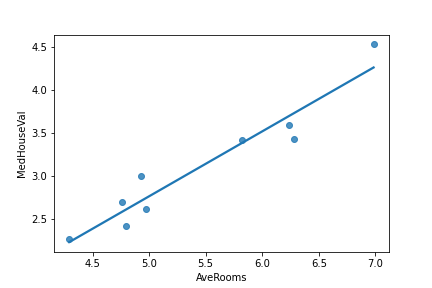
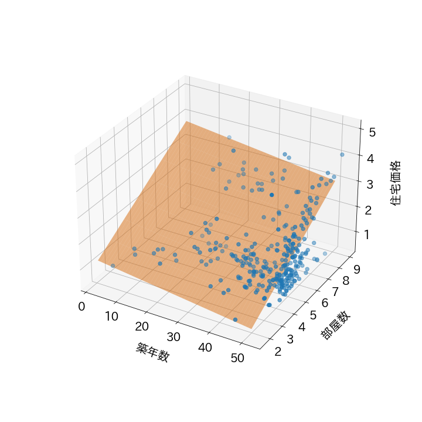
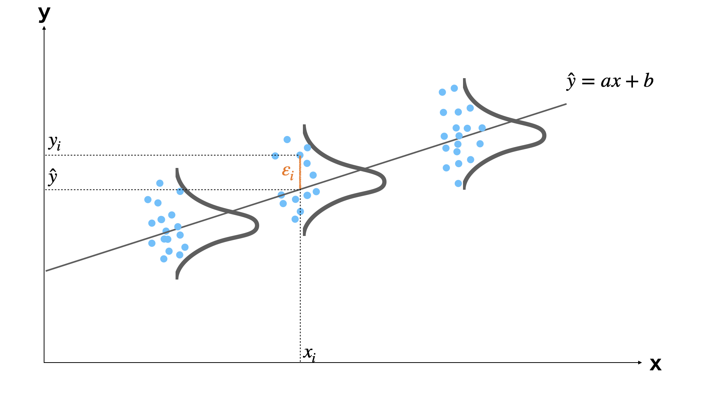
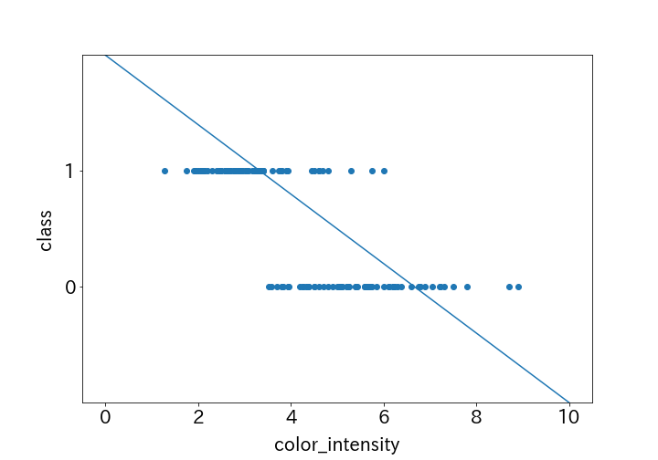
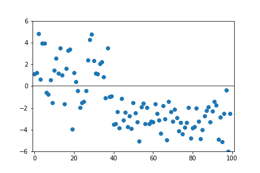
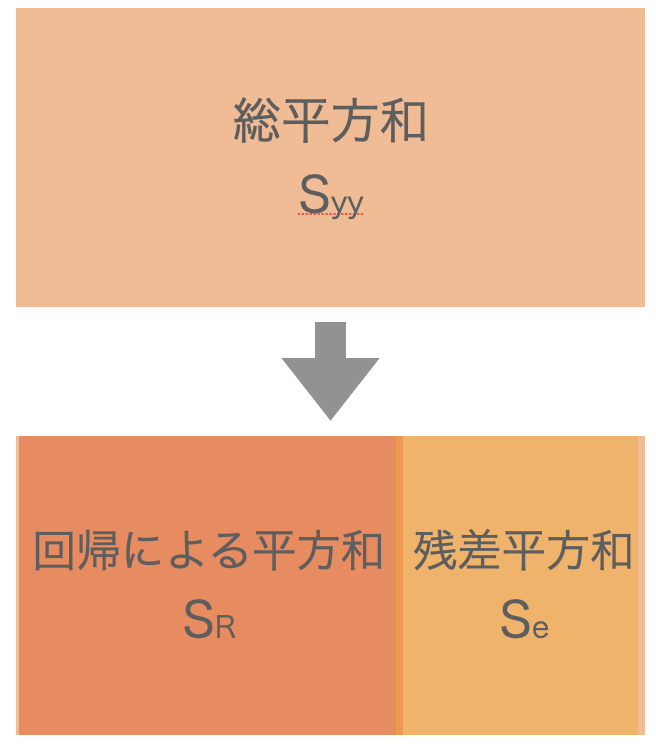
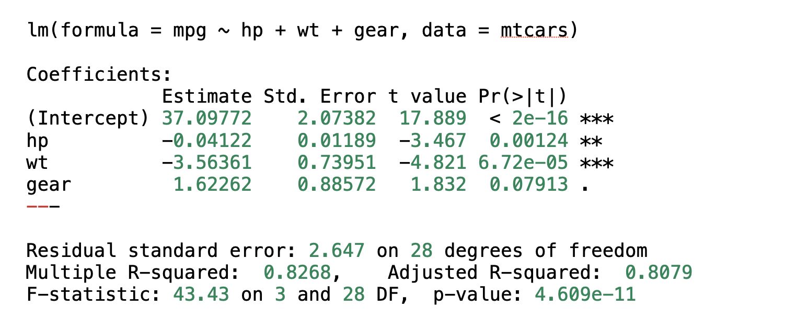

# 第11回　回帰分析

#### ■ 問1　単回帰分析
<b>回帰分析</b>
複数の変数を持つデータにおいて、ある1つの変数と他の変数との関係を説明、検討する手法。
選ばれた1つの変数を目的変数、他の変数を説明変数と言う。
すなわち回帰分析とは、目的変数と説明変数との関係を説明、検討すること。

<b>回帰方程式、回帰係数（偏回帰係数）</b>
目的変数と説明変数との関係は$y=ax_{1}+bx_{2}+c$のような数式で表され、この式を回帰方程式と言う。
また、この定数$a, b$のような変数にかかる定数のことを回帰係数、$c$のような独立の定数項を切片という。
$y=ax+b$のような単回帰分析の係数は回帰係数、$y=ax_{1}+bx_{2}+c$のような重回帰分析の係数は偏回帰係数と呼ばれることが多い。

<b>単回帰分析</b>
目的変数の値を、1種類の説明変数を使って表す手法。
回帰方程式は$y=ax_{1}+b$のような式で表され、直線のグラフが描ける。

<b>重回帰分析</b>
目的変数の値を、2種類以上の説明変数を使って表す手法。
回帰方程式は$y=ax_{1}+bx_{2}+...+z$のような式で表される。
説明変数が2種類の場合は平面のグラフが描ける。

説明変数が3種類以上の場合は超平面と呼ばれる空間を表し、2次元の画面上に描くことはできない。

<b>実測値(観測値)</b>
実際に得られた目的変数の値。
$y$で表されることが多い。

<b>予測値</b>
回帰方程式を使って、説明変数から算出した目的変数の値。
実測値と区別するために、$\hat{y}$で表されることが多い。

<b>残差</b>
実測値と予測値の差。
$\varepsilon$で表されることが多い。

<u>単回帰分析の回帰方程式の求め方</u>
回帰方程式$y=ax+b$の定数$a, b$を求めれば良い。
$i$番目のデータから観測される目的変数の実測値$y_{i}$と、回帰方程式から得られる目的変数の予測値$\hat{y}_{i}$との差（残差）を$\varepsilon_{i}$とすると、
$$
\varepsilon_{i} = y_{i} - \hat{y}_{i} = y_{i} - (ax_{i} + b)
$$
1番目からn番目のデータについても同様に考えて、
$$
\varepsilon_{1} = y_{1} - (ax_{1} + b)\\
\vdots\\
\varepsilon_{i} = y_{i} - (ax_{i} + b)\\
\vdots\\
\varepsilon_{n} = y_{n} - (ax_{n} + b)\\
$$
この残差$\varepsilon$の総量が小さいほど、回帰方程式は$x$と$y$の関係をよく表していると言える。
ただし、$\varepsilon$には正と負の値があるので、そのまま足すと打ち消し合ってしまう。
そこで、平方和と同じように二乗和を考える。
$$
\begin{align}
S_{e} &= \varepsilon_{1}^{2} + \varepsilon_{2}^{2} + \cdots + \varepsilon_{n}^{2} \\
&= \sum_{i=1}^{n} \varepsilon_{i}^{2} \\
&= \sum_{i=1}^{n} \{y_{i} - (ax_{i} + b)\}^{2}
\end{align}
$$
この残差の二乗和（残差平方和）$S_{e}$が最も小さくなるような定数$a, b$を求めていく。
この方法を最小二乗法という。
\
残差平方和$S_{e}$が最も小さくなるとき、以下の式が成り立つ。
$$
\frac{\partial S_{e}}{\partial a} = 0, \quad \frac{\partial S_{e}}{\partial b} = 0
$$
これらを計算すると、$a, b$の値を求めることができる。

<u>重回帰分析の回帰方程式の求め方</u>
単回帰分析と同様に考える。
$$
\varepsilon_{i} = y_{i} - \hat{y}_{i} = y_{i} - (ax_{1i} + bx_{2i} + c)
$$
そして、残差平方和を考える。
$$
\begin{align}
S_{e} &= \sum_{i=1}^{n} \{y_{i} - (ax_{1i} + bx_{2i} + c)\}^{2}
\end{align}
$$
同様に、残差平方和$S_{e}$が最も小さくなるとき、以下の式が成り立つ。
$$
\frac{\partial S_{e}}{\partial a} = 0, \quad \frac{\partial S_{e}}{\partial b} = 0, \quad \frac{\partial S_{e}}{\partial c} = 0
$$
これらを計算すると、$a, b, c$の値を求めることができる。

<u>残差プロット</u>
最小二乗法で回帰方程式を求める場合、それぞれの残差は互いに独立に$N(0, \sigma^{2})$に従い、変数$x_{i}$に対して独立である必要がある。

例えば以下のようなデータの場合、それぞれの残差は互いに独立に$N(0, \sigma^{2})$に従っておらず、変数$x_{i}$に対しても独立ではないため、最小二乗法を使って単回帰分析や重回帰分析のような直線や平面で目的変数を予測することはできない。

直線や平面で目的変数を予測することの妥当性を確認するために、残差プロットを使う。
例えば以下のような場合、残差プロットに特に目立った傾向を観察することはできないため、最小二乗法による予測モデルで予測することは妥当だと考えられる。

一方、以下のような場合は残差の値に一定の傾向が観察されるため、最小二乗法による予測モデルが適当でない可能性がある。

<u>単回帰分析の最小二乗法による推定</u>
上記式を計算すると、切片と係数は以下の式で表される。
$$
a = \frac{Cov(x, y)}{V(x)}, \quad b = \bar{y} - a\bar{x}
$$
また、共分散と分散の定義は以下のとおり。
$$
Cov(x, y) = \frac{\displaystyle\sum_{i=1}^{n}(x_{i} - \bar{x})(y_{i} - \bar{y})}{n}\\
\,\\
V(x) = \frac{\displaystyle\sum_{i=1}^{n}(x_{i} - \bar{x})^{2}}{n}
$$
よって、偏差積和$S_{xy} = \sum_{i=1}^{n}(x_{i} - \bar{x})(y_{i} - \bar{y})$、平方和$S_{xx} = \sum_{i=1}^{n}(x_{i} - \bar{x})^{2}$とすると、以下のように表すこともできる。
$$
a = \frac{S_{xy}}{S_{xx}}, \quad b = \bar{y} - a\bar{x}
$$

<u>平方和の分解</u>
上記で求めた平方和や偏差積和を使うと、残差平方和$S_{e}$は以下のように式変形できる。
$$
\begin{align}
S_{e} &= \sum_{i=1}^{n} \{y_{i} - (ax_{i} + b)\}^{2}\\
&= \sum \{(y_{i} - \bar{y}) - a(x_{i} - \bar{x})\}^{2}\\
&= \sum (y_{i} - \bar{y})^{2} -2a\sum(y_{i} - \bar{y})(x_{i} - \bar{x}) + a^{2}\sum(x_{i} - \bar{x})^{2}\\
&= S_{yy} - 2\frac{S_{xy}}{S_{xx}}S_{xy} + \frac{S_{xy}^{2}}{S_{xx}^{2}}S_{xx}\\
&= S_{yy} - \frac{S_{xy}^{2}}{S_{xx}}\\
&= S_{yy} - S_{R} \quad(S_{R} = \frac{S_{xy}^{2}}{S_{xx}})
\end{align}
$$
また、$S_{yy}$は目的変数の平方和、すなわち総平方和であるから、上記式から平方和は以下のように分解できる。
$$
S_{yy}(総平方和) = S_{R}(回帰による平方和) + S_{e}(残差平方和)
$$

分散分析と同じ。
また、${S_{R}}/{S_{yy}}$は$y$の変動のうち、回帰による変動の割合を表すもので、寄与率と呼ばれる。

※
単回帰分析も分散分析と同じように平方和を分解して考えた。
従って、単回帰分析も分散分析と同じように検討することができる。

分散分析では「総平方和$S_{T}$」を「郡間平方和$S_{A}$」と「郡内平方和$S_{E}$」に分け、それぞれの平均平方の比$F_{0}=V_{A}/V_{E}$を計算し、$F_{0} \geq F(\phi_{A}, \phi_{E}, \alpha)$かどうか検定した。

回帰分析では「総平方和$S_{yy}$」を「回帰による平方和$S_{R}$」と「残差平方和$S_{e}$」に分け、それぞれの平均平方の比$F_{0}=V_{R}/V_{e}$を計算し、$F_{0} \geq F(\phi_{R}, \phi_{e}, \alpha)$かどうか検定する。

$F_{0} \geq F(\phi_{R}, \phi_{e}, \alpha)$であれば「回帰による平方和$S_{R}$」が「残差平方和$S_{e}$」よりも十分大きいということなので、回帰に意味があると結論づける。

| 要因 | 平方和 | 自由度 | 平均平方 | F値|
|:-:| :-: | :-: | :-: | :-: |
| R | SR | φR=2-1=1 | VR | VR/Ve |
| 残差 | Se | φe=n-2 | Ve | |
| 全体 | Syy | φyy=n-1 |  | |

<u>回帰係数の検定</u>
最小二乗法で求めた回帰方程式$\hat{y}=ax+b$の回帰係数$a, b$は統計量なので分布を持つ。
算出した回帰係数をそれぞれ$\hat{a}, \hat{b}$とすると、
$$
\hat{a}はN(a, \frac{\sigma^{2}}{S_{xx}})、\hat{b}はN(b, (\frac{1}{n}+\frac{\bar{x}^{2}}{S_{xx}})\sigma^{2})に従う。
$$

回帰係数の検定の流れ
$a$については、
①$u=\frac{\hat{a}-a}{\sqrt{\sigma^{2}/S_{xx}}}$が$N(0, 1^{2})$に従う。
②母分散$\sigma^{2}$は不明なので、標本から算出した残差の平均平方$V_{e}$を使う（不偏分散と同じように）。
③このとき、$t_{0}=\frac{\hat{a}-a}{\sqrt{V_{e}/S_{xx}}}$は自由度$\phi_{e}=n-2$の$t$分布に従う。
④検定を行う場合は、$a$の値があらかじめ指定されているので、算出した回帰係数$\hat{a}$が指定されている$a$と等しいかどうか、$t$検定を行う。

$b$についても同様に$t$検定を行う。

■ 解答

notebook参照

#### ■ 問2　データの種類
データには質的変数と量的変数の2種類がある。
<b>質的変数</b>
性別（男、女）や合否（○、×）、ランキング（優、良、可）、アンケートの満足度(満足、普通、不満)など、種類を区別する変数のこと。
カテゴリカル変数、カテゴリーデータ、カテゴリカルデータとも呼ばれる。

<b>量的変数</b>
身長、体重、温度、時間、年齢、回数、人数など、数値で表される変数で、数値どうしを足したり引いたり、比を取ったりすることに意味がある変数のこと。
量的変数は連続値と離散値に分けられる。

①連続値
量的変数の中で、値が連続的に変化する変数。
隣り合う2つの値を取ったときに、2値の間の値を無限に考えられる。
身長、体重、温度、時間などが挙げられる。

例：身長160cmと161cmの間の値を取ると、160.1cm, 160.01cmなど、無限に考えられる。

②離散値
量的変数の中で、値が不連続に変化する変数。
隣り合う2つの値を取ったときに、2値の間の値を考えられない。
年齢、人数、回数などが挙げられる。

例：3人家族、4人家族の間の人数として、3.5人家族などは考えられない。

<u>ダミー変数化</u>
性別（男、女）や合否（○、×）、ランキング（優、良、可）、アンケートの満足度(満足、普通、不満)などの質的変数を数値に変換すること。
例えば、アンケートの満足度を(1:満足、2:普通、3:不満)などにし、数値で表すことができる。
数値で表すことによって回帰分析の説明変数として使えるものもある。
量的変数と異なり、足したり引いたり、比を取ったりすることはできない。

■ 解答
1.　年齢、身長、体重

2.　性別、学年、クラス

<b>ダミー変数を用いた回帰</b>

notebook参照

<b>多重共線性</b>
重回帰分析の際、複数の説明変数間で強い相関関係がある場合に発生する性質。
多重共線性がある場合、回帰係数の推定値が求まらない、または求められたとしても信頼性が低くなってしまう。

完全な多重共線性がある場合の証明：
残差平方和を考える。
$$
\begin{align}
S_{e} &= \sum_{i=1}^{n} \{y_{i} - (ax_{1i} + bx_{2i} + c)\}^{2}
\end{align}
$$
残差平方和$S_{e}$が最も小さくなるとき、以下の式が成り立つ。
$$
\frac{\partial S_{e}}{\partial a} = 0, \quad \frac{\partial S_{e}}{\partial b} = 0, \quad \frac{\partial S_{e}}{\partial c} = 0
$$
この3つの式から変数$c$を削除すると、以下の式が成り立つ。
$$
\begin{align}
① \quad V(x_{1})a + Cov(x_{1}, x_{2})b = Cov(y, x_{1})\\
② \quad Cov(x_{1}, x_{2})a + V(x_{2})b = Cov(y, x_{2})
\end{align}
$$

$x_{1}$と$x_{2}$の相関係数が$1$の場合（例えば$2x_{1i}=x_{2i}$の場合）、

$$
\begin{align}
V(x_{1}) &= E(x_{1}^{2}) - \{E(x_{1})\}^{2}\\
\,\\
V(x_{2}) &= 4V(x_{1})\\
\,\\
Cov(x_{1}, x_{2}) & = E(x_{1}x_{2}) - E(x_{1})E(x_{2})\\
& = 2E(x_{1}^{2}) - 2\{E(x_{1})\}^{2}\\
&= 2V(x_{1})\\
\,\\
Cov(y, x_{1}) & = E(yx_{1}) - E(y)E(x_{1})\\
\,\\
Cov(y, x_{2}) & = E(yx_{2}) - E(y)E(x_{2})\\
&= 2E(yx_{1}) - 2E(y)E(x_{1})\\
&= 2Cov(y, x_{1})
\end{align}
$$

となるので、①、②の式は以下のように変形できる。

$$
\begin{align}
③ \quad V(x_{1})a + 2V(x_{1})b = Cov(y, x_{1})\\
④ \quad 2V(x_{1})a + 4V(x_{1})b = 2Cov(y, x_{1})
\end{align}
$$

③と④は同じ式となり、未知数が$a, b$の2つに対して方程式が1つなので、解が1つに定まらない。
よって、回帰係数の推定値が求められない。

notebook参照

#### ■ 問3　統計ソフトウェアの活用
<b>決定係数</b>
算出した回帰方程式の精度を表す指標で、以下の式で表される。
実測のデータに対して、回帰方程式がどれくらい説明できているかを表している。
一般的には0~1の値をとり、1に近いほど回帰方程式の精度が良いと言える。
(予測精度が悪いとき、決定係数はマイナスの値を取るときもある。)
$$
r^{2} = 1 - \frac{\displaystyle\sum_{i=1}^{n}(y_{i} - \hat{y_{i}})^{2}}{\displaystyle\sum_{i=1}^{n}(y_{i} - \bar{y})^{2}}
$$

また、式変形すると以下のようになる。

$$
r^{2} = 1 - \frac{\displaystyle\sum_{i=1}^{n}(y_{i} - \hat{y_{i}})^{2}}{\displaystyle\sum_{i=1}^{n}(y_{i} - \bar{y})^{2}} = \frac{\displaystyle\sum_{i=1}^{n}(y_{i} - \bar{y})^{2} - \displaystyle\sum_{i=1}^{n}(y_{i} - \hat{y_{i}})^{2}}{\displaystyle\sum_{i=1}^{n}(y_{i} - \bar{y})^{2}}
$$

$\displaystyle\sum_{i=1}^{n}(y_{i} - \bar{y})^{2}$は目的変数の平方和、すなわち総平方和$S_{yy}=\displaystyle\sum_{i=1}^{n}(y_{i} - \bar{y})^{2}$
$\displaystyle\sum_{i=1}^{n}(y_{i} - \hat{y_{i}})^{2}$は目的変数の実測値と予測値の差の平方和、すなわち残差平方和$S_{e}=\displaystyle\sum_{i=1}^{n}(y_{i} - \hat{y_{i}})^{2}$

また、平方和の分解のところで、以下の式が成り立つことを証明した。

$$
S_{yy}(総平方和) = S_{R}(回帰による平方和) + S_{e}(残差平方和)
$$

よって、決定係数$r^{2}$は以下の式でも表される。

$$
r^{2} = \frac{S_{yy} - S_{e}}{S_{yy}} = \frac{S_{R}}{S_{yy}}
$$

つまり、全変動に対して回帰変動の割合を表している。
すなわち、寄与率と同じ。

また、$S_{R} = \frac{S_{xy}^{2}}{S_{xx}}$なので、以下のようにも表すことができる。

$$
r^{2} = \frac{S_{R}}{S_{yy}} = \frac{S_{xy}^{2}}{S_{xx}S_{yy}} = \Bigr(\frac{S_{xy}}{\sqrt{S_{xx}S_{yy}}}\Bigl)^{2} = \Bigr(\frac{Cov(x, y)}{\sqrt{V(x)V(y)}}\Bigl)^{2}
$$

従って、決定係数は相関係数の二乗と一致する。

<b>自由度調整済み決定係数</b>
決定係数は説明変数の数が増えれば増えるほど値が大きくなる性質を持つ。

証明：
決定係数は以下の式で表される。

$$
r^{2} = 1 - \frac{\displaystyle\sum_{i=1}^{n}(y_{i} - \hat{y_{i}})^{2}}{\displaystyle\sum_{i=1}^{n}(y_{i} - \bar{y})^{2}}
$$

したがって、残差平方和$S_{e}=\displaystyle\sum_{i=1}^{n}(y_{i} - \hat{y_{i}})^{2}$の値が小さいほど決定係数の値は大きくなる。
説明変数が2個のときの残差平方和を$S_{e2}$とすると、$S_{e2}$は以下の式で表される。

$$
S_{e2} = \displaystyle\sum_{i=1}^{n}\{y_{i} - (ax_{1} + bx_{2} + c)\}^{2}
$$

最小二乗法では、$S_{e2}$が最小になるような係数$a, b, c$を求めるので、任意の係数$\alpha, \beta, \gamma$に対して以下の式が成り立つ。

$$
S_{e2} = \displaystyle\sum_{i=1}^{n}\{y_{i} - (ax_{1} + bx_{2} + c)\}^{2} \leq \displaystyle\sum_{i=1}^{n}\{y_{i} - (\alpha x_{1} + \beta x_{2} + \gamma)\}^{2}
$$

次に、説明変数が3個のときの残差平方和を$S_{e3}$とすると、$S_{e3}$は以下の式で表される。

$$
S_{e3} = \displaystyle\sum_{i=1}^{n}\{y_{i} - (ax_{1} + bx_{2} +zx_{3} + c)\}^{2}
$$

同様に、最小二乗法では$S_{e3}$が最小になるような係数$a, b, z, c$を求めるので、任意の係数$\alpha, \beta, \zeta, \gamma$に対して以下の式が成り立つ。

$$
S_{e3} = \displaystyle\sum_{i=1}^{n}\{y_{i} - (ax_{1} + bx_{2} +zx_{3} + c)\}^{2} \leq \displaystyle\sum_{i=1}^{n}\{y_{i} - (\alpha x_{1} + \beta x_{2} + \zeta x_{3} + \gamma)\}^{2}
$$

$\alpha, \beta, \zeta, \gamma$は任意の値なので、$\alpha=a, \beta=b, \zeta=0, \gamma=c$を代入すると、

$$
S_{e3} = \displaystyle\sum_{i=1}^{n}\{y_{i} - (ax_{1} + bx_{2} +zx_{3} + c)\}^{2} \leq \displaystyle\sum_{i=1}^{n}\{y_{i} - (ax_{1} + bx_{2} + 0*x_{3} + c)\}^{2} = S_{e2}
$$

この性質は説明変数を4個、5個と増やしても成り立つ。
よって、説明変数が多い方が残差平方和は小さくなるので、決定係数は大きくなる。

notebook参照

目的変数の変動とはあまり関係がない説明変数でも回帰方程式に取り入れると値が良くなる決定係数は、回帰方程式の精度を表す指標としては良くない。
そこで、決定係数の値を自由度で補正した自由度調整済み決定係数を考える。
自由度調整済み決定係数は英語で「Adjusted R_squared」と呼ばれ、以下の式で表される。

$$
r^{2} = 1 - \frac{\frac{\sum_{i=1}^{n}(y_{i} - \hat{y_{i}})^{2}}{n-1-k}}{\frac{\sum_{i=1}^{n}(y_{i} - \bar{y})^{2}}{n-1}} \quad(nはデータ数、kは説明変数の数)
$$

この式では、目的変数の変動とはあまり関係がない説明変数を回帰方程式に取り入れると、残差平方和が小さくなる影響よりも説明変数が増える影響の方が大きくなるので、決定係数の値は大きくならない。
また、データ数$n$が非常に大きいとき、決定係数と自由度調整済み決定係数の値はあまり変わらない。

■ 解答
1.　データ数：32

データ数を$n$とすると、
説明変数の自由度$\phi_{R} = 4 - 1 = 3$
全体の自由度$\phi_{yy} = n - 1$
残差の自由度$\phi_{e} = \phi_{yy} - \phi_{R} = 28$
なので、
$$
\begin{align}
n &= \phi_{yy} + 1 \\
&= \phi_{R} + 28 + 1 \\
&= 3 + 28 + 1 \\
&= 32
\end{align}
$$

2.　回帰式は車の燃費を説明できている（回帰に意味がある）。

F-statisticの欄を確認すると、p値が4.609e-11となっている。
p値が有意水準0.05より小さいので、回帰による平方和が残差平方和よりも十分大きく、回帰に意味があると言える。

3.　馬力(hp)：意味がある（回帰係数が0ではない）。
　　重量(wt)：意味がある（回帰係数が0ではない）。
　　ギアの数(gear)：意味があるとは言えない（回帰係数が0ではないとは言えない）。

Coefficients:の欄を確認すると、Pr(>|t|)、すなわちp値がそれぞれhp:0.00124、wt:6.72e-05、gear:0.07913となっている。
hpとwtはp値が有意水準0.05より小さいので、回帰係数は0ではないと言える。
一方、gearはp値が有意水準0.05以上なので、回帰係数は0ではないとは言えない。

4.　決定係数：0.8268

Multipul R-squaredの値を確認する。

5.　自由度調整済み決定係数：0.8079

Adjusted R-squaredの値を確認する。

#### 変数変換
ある関数を使って確率変数を別の分布に従う確率変数に変換すること。
線形近似をしたいが、データの分布に偏りがあるときなどに使われる。

notebook参照