# 第8回　検定①

#### ■ 問1　母比率の区間推定

<b>二項分布の正規近似</b>
ベルヌーイ試行を1回行った結果が従う分布がベルヌーイ分布。
ベルヌーイ試行を$n$回行った結果の和が従う分布が二項分布。
すなわち、二項分布に従う確率変数は、ベルヌーイ分布に従う確率変数の和と考えられる。
よって、ベルヌーイ分布に従う確率変数を$x_{i}$、二項分布$B(n, p)$に従う確率変数を$X$とすると、
$$
X = x_{1} + x_{2} + ... + x_{n}
$$
それぞれ$n$で割って、
$$
\frac{X}{n} = \frac{x_{1} + x_{2} + ... + x_{n}}{n}
$$
すなわち、$\frac{X}{n}$はベルヌーイ分布に従う確率変数$x$の標本平均と言える。
また、ベルヌーイ分布に従う確率変数$x$は$E(x) = p, V(x) = p(1 - p)$であるから、$n$が十分に大きいとき、中心極限定理(第3回講座)より、
$$
\frac{X}{n}は近似的に正規分布N(p, \frac{p(1-p)}{n})に従う
$$
$n$倍すると、
$$
二項分布B(n, p)に従う確率変数Xは、近似的に正規分布N(np, np(1-p))に従う
$$
このことを二項分布の正規近似という。

<b>母比率の推定</b>
二項分布の正規近似で考えた$\frac{X}{n}$は、ベルヌーイ試行の成功数$X$を試行数$n$で割った値、すなわち標本の成功する比率（確率）$\hat{p}$を表す。
従って、標本比率を$\hat{p}$、母比率を$p$とすると、
$$
\hat{p}は近似的にN(p, \frac{p(1-p)}{n})に従う
$$
これを標準化すると、
$$
u = \frac{\hat{p}-p}{\sqrt{\frac{{p(1-p)}}{n}}}は近似的にN(0, 1^{2})
に従う。
$$

<b>区間推定の流れ</b>
①標本比率を標準化する。
②信頼係数95%の場合、標準化した値が標準正規分布の真ん中95%の面積の範囲にあれば良い。
③すなわち、左側2.5%、右側2.5%に入らなければ良い。
④正規分布は左右対称なので、正の値の右側2.5%(0.025)の位置を標準正規分布表から調べる。
⑤標準正規分布表から、1.96が右側2.5%の位置だとわかる。（-1.96が左側2.5%の位置）
⑥$-1.96\leq\frac{\hat{p}-p}{\sqrt{\frac{{p(1-p)}}{n}}}\leq1.96$が信頼係数95%の信頼区間となる。
⑦これを$p$について解くと、$\hat{p}-1.96\sqrt{\frac{{p(1-p)}}{n}}\leq p\leq\hat{p}+1.96\sqrt{\frac{{p(1-p)}}{n}}$となる。
⑧これが求めたい信頼区間となるが、$p$は母比率の値なので不明。ここで、$\hat{p}$は$p$の一致推定量なので、$n$が十分大きいとき、$\hat{p}=p$となるので$p$を$\hat{p}$で置き換える。
⑨よって、$\hat{p}-1.96\sqrt{\frac{{\hat{p}(1-\hat{p})}}{n}}\leq p\leq\hat{p}+1.96\sqrt{\frac{{\hat{p}(1-\hat{p})}}{n}}$が求めたい信頼区間となる。

■ 解答
1.　点推定：0.1
母比率の点推定は標本比率とすれば良いので、
$$
\hat{p} = \frac{20}{200} = 0.1
$$

2.　95%信頼区間：(0.059, 0.14)
まず、標準化した標本比率$u$を考える。
$$u = \frac{\hat{p}-p}{\sqrt{\frac{{p(1-p)}}{n}}}$$

次に、右側2.5%(0.025)の位置を標準正規分布表から調べる。

1.96だとわかったので、$-1.96\leq\frac{\hat{p}-p}{\sqrt{\frac{{p(1-p)}}{n}}}\leq1.96$が信頼係数95%の信頼区間。
これを$p$について解くと、
$$
\hat{p}-1.96\sqrt{\frac{{p(1-p)}}{n}}\leq p\leq\hat{p}+1.96\sqrt{\frac{{p(1-p)}}{n}}
$$
となる。平方根の中の$p$に$\hat{p}$を代入して、
$$
\hat{p}-1.96\sqrt{\frac{{\hat{p}(1-\hat{p})}}{n}}\leq p\leq\hat{p}+1.96\sqrt{\frac{{\hat{p}(1-\hat{p})}}{n}}
$$
となる。

最後に、文字に値を代入して信頼区間を求める。
$n=200, \hat{p} = 0.1$より、
$$
0.1-1.96\sqrt{\frac{0.1(1-0.1)}{200}}\leq p \leq0.1+1.96\sqrt{\frac{0.1(1-0.1)}{200}}\\
\,\\
0.1-1.96 \times 0.021\leq p \leq0.1+1.96 \times 0.021\\
\,\\
0.0588 \leq p \leq 0.141
$$
よって、95%信頼区間は(0.059, 0.14)

#### ■ 問2　母比率の区間推定

Notebook参照

#### ■ 問3　母比率の差の区間推定

<b>区間推定の流れ</b>
二項分布$B(n_{1}, p_{1})$に従う確率変数$x_{1}$は、近似的に正規分布$N(n_{1}p_{1}, n_{1}p_{1}(1-p_{1}))$に従い、
二項分布$B(n_{2}, p_{2})$に従う確率変数$x_{2}$は、近似的に正規分布$N(n_{2}p_{2}, n_{2}p_{2}(1-p_{2}))$に従う。
$x_{1}$と$x_{2}$は互いに独立なので、$x_{1} - x_{2}$は近似的に$N(n_{1}p_{1} - n_{2}p_{2}, n_{1}p_{1}(1-p_{1}) + n_{2}p_{2}(1-p_{2}))$に従う。（第3回「正規分布の再生性」）
したがって、$\hat{p_{1}} = \frac{x_{1}}{n_{1}}$、$\hat{p_{2}} = \frac{x_{2}}{n_{2}}$とすると、
$$
\hat{p_{1}} - \hat{p_{2}}は近似的にN(p_{1}-p_{2}, \frac{{p_{1}(1-p_{1})}}{n_{1}}+\frac{{p_{2}(1-p_{2})}}{n_{2}})に従う
$$
すなわち、
$$
u = \frac{\hat{p}_{1}-\hat{p}_{2} - (p_{1} - p_{2})}  {\sqrt{\frac{{p_{1}(1-p_{1})}}{n_{1}} + \frac{{p_{2}(1-p_{2})}}{n_{2}}}}は近似的にN(0, 1^{2})に従う
$$

\
手順
①2つの標本比率の値をそれぞれ算出する。
②その差のデータから、統計量$u$の式を考える（操作は標準化と同じ）。
③信頼係数95%の場合、統計量$u$が標準正規分布の真ん中95%の面積の範囲にあれば良い。
⑤すなわち、左側2.5%、右側2.5%に入らなければ良い。
⑥正規分布は左右対称なので、正の値の右側2.5%(0.025)の位置を標準正規分布表から調べる。
⑦標準正規分布表から、1.96が右側2.5%の位置だとわかる。（-1.96が左側2.5%の位置）
⑧$-1.96\leq\frac{\hat{p}_{1}-\hat{p}_{2} - (p_{1} - p_{2})}  {\sqrt{\frac{{p_{1}(1-p_{1})}}{n_{1}} + \frac{{p_{2}(1-p_{2})}}{n_{2}}}}\leq1.96$が信頼係数95%の信頼区間となる。
⑨これを$p_{1}-p_{2}$について解くと、$\hat{p}_{1}-\hat{p}_{2}-1.96\sqrt{\frac{{p_{1}(1-p_{1})}}{n_{1}} + \frac{{p_{2}(1-p_{2})}}{n_{2}}}\leq\mu\leq\hat{p}_{1}-\hat{p}_{2}+1.96\sqrt{\frac{{p_{1}(1-p_{1})}}{n_{1}} + \frac{{p_{2}(1-p_{2})}}{n_{2}}}$となる。
⑩これが求めたい信頼区間となる。

■ 解答
1.　95%信頼区間：(-0.084, 0.064)
装置Aの標本比率と装置Bの標本比率はそれぞれ、
$$
p_{A} = \frac{20}{200} = 0.1\\
\,\\
p_{B} = \frac{11}{100} = 0.11
$$

次に、標準化した標本比率の差$u$を考える。
$$u = \frac{\hat{p}_{A}-\hat{p}_{B} - (p_{A} - p_{B})}  {\sqrt{\frac{{p_{A}(1-p_{A})}}{n_{A}} + \frac{{p_{B}(1-p_{B})}}{n_{B}}}}$$

次に、右側2.5%(0.025)の位置を標準正規分布表から調べる。

1.96だとわかったので、$-1.96\leq\frac{\hat{p}_{A}-\hat{p}_{B} - (p_{A} - p_{B})}  {\sqrt{\frac{{p_{A}(1-p_{A})}}{n_{A}} + \frac{{p_{B}(1-p_{B})}}{n_{B}}}}\leq1.96$が信頼係数95%の信頼区間。
これを$p_{A}-p_{B}$について解くと、
$$
\hat{p}_{A}-\hat{p}_{B}-1.96\sqrt{\frac{{p_{A}(1-p_{A})}}{n_{A}} + \frac{{p_{B}(1-p_{B})}}{n_{B}}}\leq p_{A}-p_{B}\leq\hat{p}_{A}-\hat{p}_{B}+1.96\sqrt{\frac{{p_{A}(1-p_{A})}}{n_{A}} + \frac{{p_{B}(1-p_{B})}}{n_{B}}}
$$
となる。平方根の中の$p_{A}, p_{B}$にそれぞれ$\hat{p}_{A}, \hat{p}_{B}$を代入して、
$$
\hat{p}_{A}-\hat{p}_{B}-1.96\sqrt{\frac{{\hat{p}_{A}(1-\hat{p}_{A})}}{n_{A}} + \frac{{\hat{p}_{B}(1-\hat{p}_{B})}}{n_{B}}}\leq p_{A}-p_{B}\leq\hat{p}_{A}-\hat{p}_{B}+1.96\sqrt{\frac{{\hat{p}_{A}(1-\hat{p}_{A})}}{n_{A}} + \frac{{\hat{p}_{B}(1-\hat{p}_{B})}}{n_{B}}}
$$
となる。

最後に、文字に値を代入して信頼区間を求める。
$n_{A}=200, n_{B}=100, \hat{p}_{A} = 0.1, \hat{p}_{B}=0.11$より、
$$
-0.01-1.96\sqrt{\frac{0.1(1-0.1)}{200} + \frac{0.11(1-0.11)}{100}}\leq p_{A}-p_{B} \leq -0.01+1.96\sqrt{\frac{0.1(1-0.1)}{200} + \frac{0.11(1-0.11)}{100}}\\
\,\\
-0.01-1.96 \times 0.0378\leq p \leq -0.01+1.96 \times 0.0378\\
\,\\
-0.0841 \leq p \leq 0.0641
$$
よって、95%信頼区間は(-0.084, 0.064)

Pythonでは、母比率の差に関するライブラリはない。

#### ■ 問4　相関係数の区間推定

相関係数$r$もデータから計算できるものなので統計量の1つ。
相関分析を行うデータについては、$x$は$N(\mu_{x}, \sigma^{2}_{x})$に従い、$y$は$N(\mu_{y}, \sigma^{2}_{y})$に従うと考える。
母相関係数を$\rho$とすると、以下の式で表せる。
$$
\rho = \frac{Cov(x, y)}{\sqrt{V(x)V(y)}} = \frac{E[(x-\mu_{x})(y-\mu_{y})]}{\sqrt{\sigma^{2}_{x}\sigma^{2}_{y}}} \quad(-1\leq \rho \leq 1)
$$
統計量$r$に基づいて、母相関係数$\rho$の推定を行う。

$r$の分布は$\rho$やデータ数$n$によって異なり、次のことが知られている。

$\rho=0$のとき
$$
t = \frac{r\sqrt{n-2}}{\sqrt{1-r^{2}}}は自由度n-2のt分布に従う
$$

$\rho\neq0$のとき
$$
Z = \frac{1}{2}\ln\frac{1+r}{1-r}は近似的にN(\frac{1}{2}\ln\frac{1+\rho}{1-\rho}, \frac{1}{n-3})に従う
$$

<b>区間推定の流れ</b>
区間を推定するので、$\rho\neq0$と仮定して行う。

①$\zeta = \frac{1}{2}\ln\frac{1+\rho}{1-\rho}$とおくと、上の$Z$は近似的に$N(\zeta, \frac{1}{n-3})$に従う。

②$Z$を標準化する。($\sqrt{n-3}(Z-\zeta)$が$N(0, 1^{2})$に従う)
③信頼係数95%の場合、標準化した値が標準正規分布の真ん中95%の面積の範囲にあれば良い。
④すなわち、左側2.5%、右側2.5%に入らなければ良い。
⑤正規分布は左右対称なので、正の値の右側2.5%(0.025)の位置を標準正規分布表から調べる。
⑥標準正規分布表から、1.96が右側2.5%の位置だとわかる。（-1.96が左側2.5%の位置）
⑦$-1.96\leq \sqrt{n-3}(Z-\zeta) \leq1.96$が信頼係数95%の信頼区間となる。

⑧これを$\zeta$について解くと、$Z - \frac{1.96}{\sqrt{n-3}}\leq \zeta \leq Z + \frac{1.96}{\sqrt{n-3}}$となる。

⑨$\zeta_{1} = Z - \frac{1.96}{\sqrt{n-3}}$、$\zeta_{2} = Z + \frac{1.96}{\sqrt{n-3}}$とおくと、95%信頼区間は$(\zeta_{1}$, $\zeta_{2})$

⑩$\zeta = \frac{1}{2}\ln\frac{1+\rho}{1-\rho}$を$\rho$について解くと、
$$
\rho = \frac{e^{2\zeta} - 1}{e^{2\zeta} + 1}
$$
なので、95%信頼区間は
$$
(\frac{e^{2\zeta_{1}} - 1}{e^{2\zeta_{1}} + 1}, \frac{e^{2\zeta_{2}} - 1}{e^{2\zeta_{2}} + 1})
$$

■ 解答
1.　点推定：0.41
母相関係数の点推定は標本の相関係数とすれば良いので、
$$
\hat{\rho} = r = \frac{Cov(x, y)}{\sqrt{V(x)V(y)}} = \frac{10}{\sqrt{20 \times 30}} = 0.408
$$

2.　95%信頼区間：(-0.042, 0.72)
$$
Z = \frac{1}{2}\ln\frac{1+r}{1-r} = 0.434
$$

$$
\zeta_{1} = Z - \frac{1.96}{\sqrt{n-3}} = -0.0419
$$

$$
\zeta_{2} = Z + \frac{1.96}{\sqrt{n-3}} = 0.909
$$

よって、求める信頼区間は
$$
(\frac{e^{2\zeta_{1}} - 1}{e^{2\zeta_{1}} + 1}, \frac{e^{2\zeta_{2}} - 1}{e^{2\zeta_{2}} + 1}) = (-0.0418, 0.721)
$$

#### ■ 問5　母平均の検定（母分散既知）
<b>検定</b>
得られた標本から母集団についての仮説が正しいか、正しくないか、確率的に判断すること。

例
10cmの長さになるように設定した製造装置で鉛筆を20本製造し、平均10.3cmだった場合に、設定値通りと言えるかどうか確率的（客観的）に判断する(母分散は既知で$0.6^{2}$とする)。

<u>上の例での検定方法のイメージ</u>
数学の背理法の要領で行う。

標本$x_{i}$が$N(\mu, \sigma^{2}) = N(10, 0.6^{2})$に従うとする。
標本平均を標準化した値$z_{0}=\frac{\bar{x}-\mu}{\sqrt{\frac{\sigma^{2}}{n}}}=\frac{10.3-10}{\sqrt{\frac{0.6^{2}}{20}}}$は$N(0, 1^{2})$に従う。
標準正規分布表から、$z_{0}$が-1.96以下または1.96以上になる確率は5%となることがわかる。
実際に計算した$z_{0}$の値は2.27であり、1.96以上なので、このような現象は5%以下の確率でしか起こらない。
このような珍しい現象が起こることは不自然だと考える。
なぜ不自然な現象が起きたかと言うと、標本$x_{i}$が$N(10, 0.6^{2})$に従うと仮定したから(母平均が10と仮定したから)。
結論として、母平均は10ではないとするのが合理的なので、この場合は設定値通りに製造できていないと判断する。

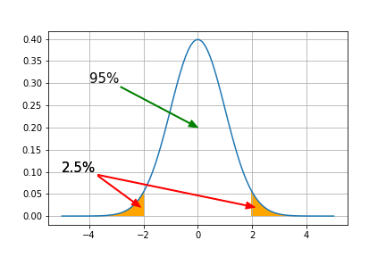

\
\
検定で使用する用語
<b>帰無仮説</b>
検定を行う際に最初に立てる仮説のこと。
検定では帰無仮説が正しいかどうかの検証を行なっていく。
Hypothesisの頭文字を取って、$H_{0}$で表されることが多い。

<b>対立仮説</b>
帰無仮説が棄却されたときに採択される仮説のこと。
$H_{1}$で表されることが多い。

帰無仮説 $H_{0}:\mu = 10$
対立仮説 $H_{1}:\mu \neq 10$
のように表される。

<b>検定統計量</b>
帰無仮説$H_{0}$が正しいとしたもとで計算される統計量のこと。
先の例では$z_{0}$が検定統計量となる。

<b>p値(P値)</b>
帰無仮説$H_{0}$が正しいとしたもとで検定統計量の絶対値がその値以上となる確率のこと。
probabilityの頭文字を取ってp値。

先の例では$z_{0}=2.27$となった。
標準正規分布表から検定統計量が$2.27$以上となる確率は$0.0116$。
両側にあるので、2倍してp値は$0.0232$。

<b>有意水準</b>
検定の際に帰無仮説が正しいかどうか判断する基準となる確率のこと。
$\alpha$で表されることが多い。

先の例では有意水準5%($\alpha$=0.05)とした。
$\alpha$の値は任意の値に設定して良い。
$\alpha$=0.05以外にも、$\alpha$=0.01や$\alpha$=0.1も使用される。
その場合、検定統計量の絶対値が2.58や1.64より大きいかどうかが基準となる。

<b>棄却域、採択域</b>
棄却域：帰無仮説$H_{0}$が棄却される領域のこと。
採択域：帰無仮説$H_{0}$が棄却されない領域のこと。

計算した検定統計量が棄却域に入っている場合「有意である」と言い、採択域に入っている場合「有意でない」と言う。
棄却域、採択域は有意水準によって異なる。
下の図の場合、もし計算した検定統計量が棄却域に入っていた場合、「有意水準5%で有意である」と言う。

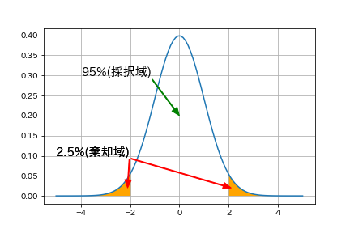

<b>両側検定と片側検定</b>
上の図のように、
帰無仮説 $H_{0}:\mu = 10$
対立仮説 $H_{1}:\mu \neq 10$
として標準正規分布の両側に棄却域を設ける検定を両側検定という。
一方、
帰無仮説 $H_{0}:\mu = 10$
対立仮説 $H_{1}:\mu < 10$
または
帰無仮説 $H_{0}:\mu = 10$
対立仮説 $H_{1}:\mu > 10$
として標準正規分布の片側に棄却域を設ける検定を片側検定という。
$\mu$が母平均$\mu_{0}$からずれるとしても小さい方にずれる、または大きい方にずれる場合しか考えない場合に片側検定を使う。
有意水準は同じでも両側検定の場合と棄却域が異なるので注意が必要。

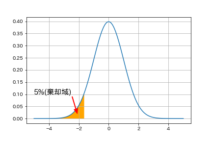

■ 解答
1.　母平均の点推定：10.3
$$
\begin{align}
\bar{x} &= \frac{10.3 + 10.5 + 9.8 + 10.2 + 10.4 + 10.8 + 10.7 + 10.7 + 9.7 + 9.9}{10}\\
&= 10.3
\end{align}
$$

2.　有意水準5%での両側検定
<b>検定の流れ</b>
①帰無仮説$H_{0}$と対立仮説$H_{1}$を設定する。
②有意水準$\alpha$を設定する。
③棄却域を確認する。
④統計検定量$z_{0}$の値を計算する。
⑤統計検定量$z_{0}$が棄却域に入っていれば「有意である」と判定し、帰無仮説$H_{0}$を棄却する。

今回の問題では、
帰無仮説 $H_{0}:\mu = \mu_{0} = 10$
対立仮説 $H_{1}:\mu \neq \mu_{0} = 10$
有意水準 $\alpha=0.05$
と設定する。
有意水準が0.05なので、その半分の値の0.025となる位置を標準正規分布表から調べると、1.96だとわかる。

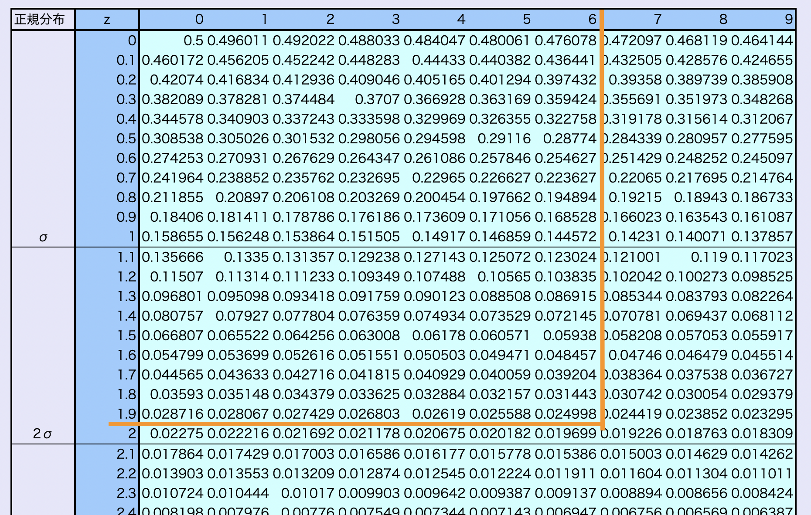

よって、棄却域は$|z_{0}|\geq1.96$

検定統計量$z_{0}$を計算すると、
$$
z_{0}=\frac{\bar{x}-\mu_{0}}{\sqrt{\frac{\sigma^{2}}{n}}}=\frac{10.3-10}{\sqrt{\frac{0.6^{2}}{20}}}=2.236
$$

$z_{0} = 2.236 \geq 1.96$となるので、有意である。
$H_{0}$を棄却し$H_{1}$と判定するので、母平均は10ではない、すなわち設定通りに製造できていないと言える。

3.　有意水準1%での両側検定
帰無仮説 $H_{0}:\mu = \mu_{0} = 10$
対立仮説 $H_{1}:\mu \neq \mu_{0} = 10$
有意水準 $\alpha=0.01$
と設定する。
有意水準が0.01なので、その半分の値の0.005となる位置を標準正規分布表から調べると、2.58だとわかる。

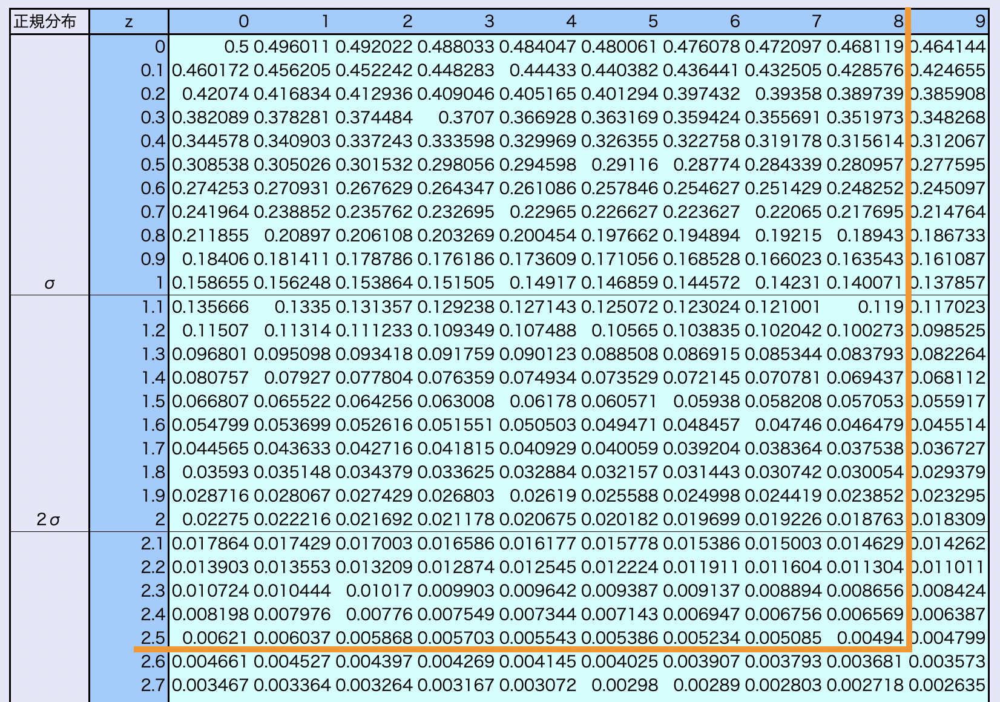

よって、棄却域は$|z_{0}|\geq2.58$

検定統計量$z_{0} = 2.236 \leq 2.58$となるので、有意でない。
$H_{0}$は棄却されないので、母平均は10ではないとは言えない。
すなわち、設定通りに製造できていないとは言えない。

$※^{1}$$H_{0}$が棄却されなかったとしても「$H_{0}$である」と断定することはできない。
$H_{1}$ではないことを検証したわけではないため。

$※^{2}$問題2, 3からわかるように、有意水準によって$H_{0}$が棄却される場合と棄却されない場合がある。
恣意的に結論を変えないように、統計検定量を計算する前に有意水準を定めておく必要がある。

4.　有意水準5%での片側検定
<b>検定の流れ</b>
帰無仮説 $H_{0}:\mu = \mu_{0} = 10$
対立仮説 $H_{1}:\mu > \mu_{0} = 10$
有意水準 $\alpha=0.05$
と設定する。
有意水準が0.05の片側検定なので、0.05の位置を標準正規分布表から調べると、1.64だとわかる。

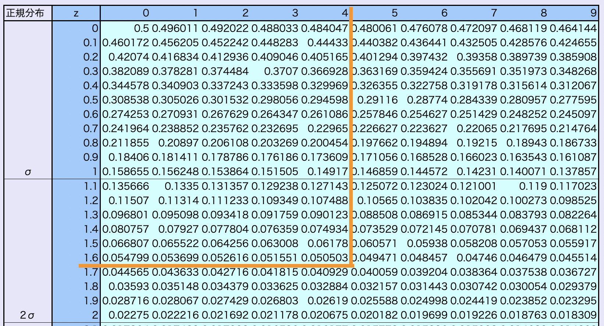

よって、棄却域は$|z_{0}|\geq1.64$

検定統計量$z_{0} = 2.236 \geq 1.64$となるので、有意である。
$H_{0}$を棄却し$H_{1}$と判定するので、母平均は10ではない、すなわち設定通りに製造できていないと言える。

#### ■ 問6　検定における2種類の過誤と検出力
検定は標本から母集団のパラメーターを確率的に推測するものなので、誤った結果になることもある。
以下の2種類の誤りが存在する。

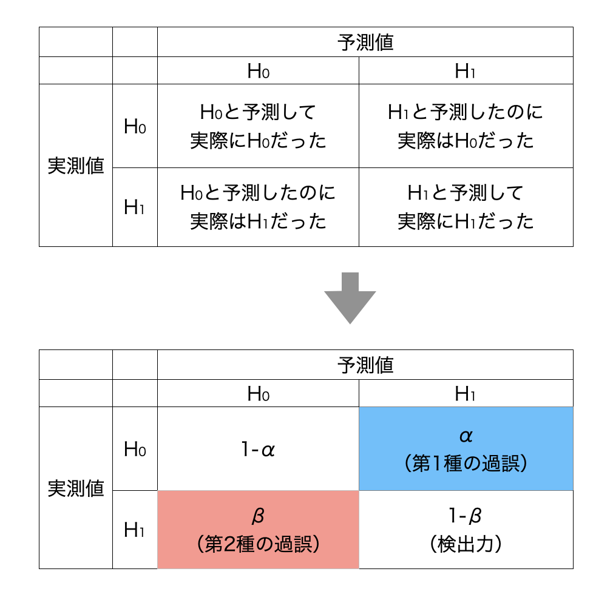

<b>第1種の過誤</b>
帰無仮説$H_{0}$が成り立っているにもかかわらず、$H_{0}$を棄却してしまう誤り。
第1種の過誤を犯す確率は有意水準$\alpha$と等しい。

<b>第2種の過誤</b>
帰無仮説$H_{0}$が成り立っていないにもかかわらず、$H_{0}$を棄却しない誤り。
第2種の過誤を犯す確率は$\beta$で表される。
$\beta$の値は$H_{0}$と$H_{1}$の重なり具合によって、0〜(1-$\alpha$)くらいまで変化する。

<b>検出力</b>
帰無仮説$H_{0}$が成り立っていないときに、$H_{0}$を棄却する確率。

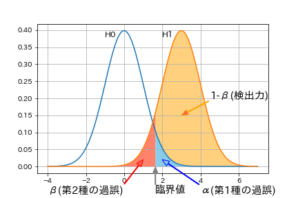

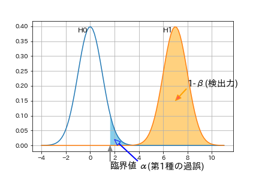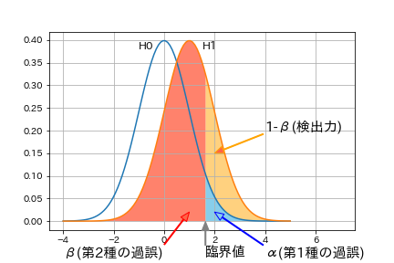

■ 解答
帰無仮説$H_{0}:x_{n}$は全て確率分布$P_{0}:N(0, 1^{2})$に従う
対立仮説$H_{1}:x_{n}$は全て確率分布$P_{1}:N(3, 1^{2})$に従う
この2つをグラフに表すと以下のようになる。
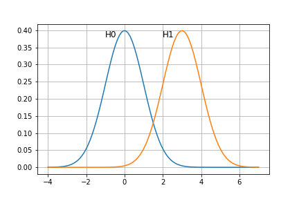

1.　第一種の過誤を犯す確率：0.05
この問題は右側片側検定なので、第一種の過誤の確率$\alpha$は以下の部分の面積を求めれば良い。
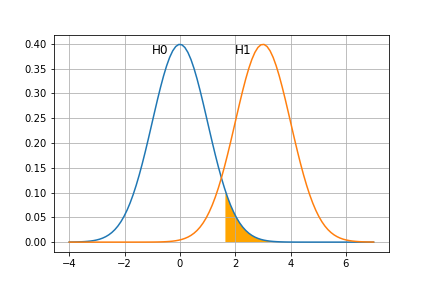

この面積は有意水準$\alpha$と同じなので、$\alpha$=0.05。

2.　第二種の過誤を犯す確率：0.087
第二種の過誤の確率$\beta$は以下の部分の面積を求めれば良い。
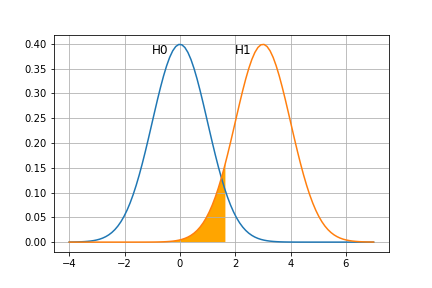

まず、$P_{0}$は標準正規分布なので、有意水準$\alpha$=0.05%の位置を標準正規分布表から求めると、1.64とわかる。
$H_{1}$のとき$x_{n}$が1.64以下となる確率を求めたい。
$P_{1}$の分布から$P_{1}$の平均値の3を引くと$P_{0}$の分布と重なるので、$1.64-3 = -1.36$の位置を標準正規分布表から求めれば良い。
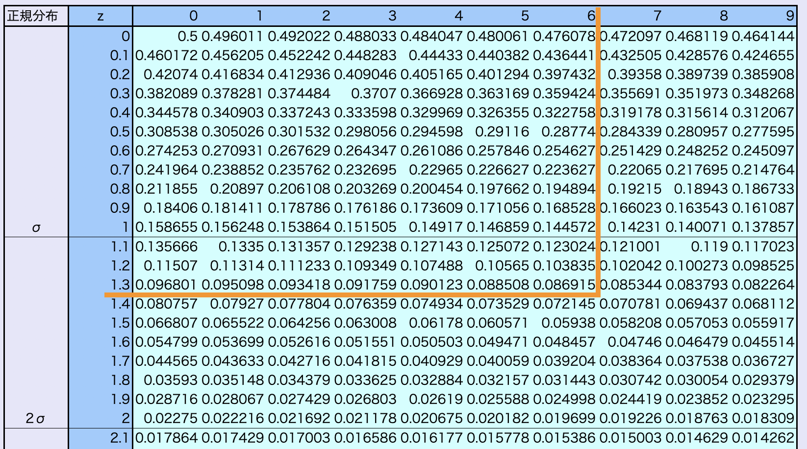
よって、第二種の過誤を犯す確率$\beta$は0.087

3.　検出力：0.91
検出力は以下の部分の面積を求めれば良い。
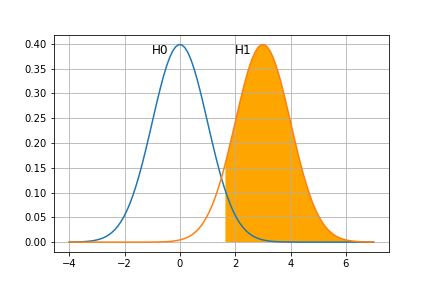

検出力は$1 - \beta$で表されるので、$1-0.087=0.913$
